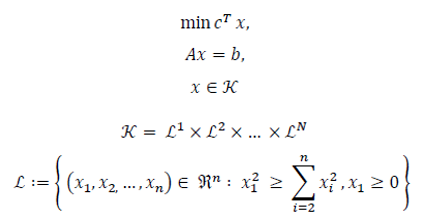

# OPLibrary

📈📉 A simple, barebone and extensible optimization library written in C++ with OOP standards.

## Usage

1. Download a recently compiled release from the **Actions** page.
2. `$ ./OPCI.exe --help` or `./OPCI.exe -f problem.txt -o solution.csv`.

_See below for input problem schema examples for currently implemented problem types._

```plain
Command line interface for OPLibrary.
Usage: OPCI.exe [OPTIONS] -f <input(s)> -o <output(s)>
Options:
         -h | --help                             prints help message
         -c | --config <config file path>        specifies config file path, replaces any CLI options
         -f | --file <input(s) file path>        specifies input(s)
         -p | --parallel                         multiple file inputs should run parallel
         -o | --output <output(s) file path>     specifies output(s)
         -s | --solver <solver type>             specifies the solver type
         --init <initializator>                  specifies initializator for primal and dual problems
         --max                                   specifies whether it is a maximization problem
         --min                                   specifies whether it is a minimization problem
         --epsilon <value>                       specifies epsilon
         --rho <value>                           specifies rho
         --sigma <value>                         specifies sigma
         --mu <value>                            specifies mu
Note:
         - same solver type, initializator, objective direction and input parameters will be used for all input problems.
         - check docs for available initializators/solvers.
```

## Documentation

| Option | Description |
| ----------- | ----------- |
| -f or --file | Space separated input files, e.g. `-f problem1.txt problem2.txt`; can have any extension. |
| -o or --output | See `-f or --file`. |
| -p or --parallel | For each input file a new executor thread will be created, problems will be resolved in parallel, but user should be responsible for uniquity of inputs and outputs. |
| -s or --solver | Currently implemented solvers are: `SOCP`. [See below for explanation of types.](#solvers)  |
| --init | Currently implemented initializators are: `Classic; Classic2; Classic3; Classic4; Markowitz`. [See below for initializator logic.](#initializators) |

### Initializators

| Initializator | Description |
| ----------- | ----------- |
| Classic | Classic initializator, where for x0 and s0 vector their first value is 1, all other 0; for y all the values are 0. |
| Classic2 | Classic initializator, where for x0 vector first value is 1, s0 vector first value is 2, all other 0; for y all the values are 1. |
| Classic3 | Classic initializator, where for x0 and s0 vector their first value is 1, all other 0; for y all the values are 1. |
| Classic4 | Classic initializator, where for x0 and s0 vector their first value is 2, second value is 1, all other 0; for y all the values are 0. |
| Markowitz | Markowitz initializator, starting points depend on the number of variables inside a cone. Will be calculated as `x := 1 / length of x`, `y := 0`, `s := 1 / length of s`. |

### Solvers

| Type | Problem Form |
| ----------- | ----------- |
| SOCP |   |

### Input examples

**SOCP**

---

Input schema

```plain
<# of constraints>

<# of cones>

<# of variables inside each cone>

<A matrix>

<b vector>

<c vector>
```

Example problem

```plain
4

4

4 4 4 4

3 1 3 2 2 2 1 2 2 4 3 1 4 1 1 3
1 3 2 2 2 1 3 3 4 1 3 2 4 3 3 1
2 1 3 2 3 2 3 4 2 2 2 2 4 4 3 2
3 3 4 2 3 2 2 4 4 3 2 2 3 4 4 1

30 30 31 38

2 1 0 0 2 1 0 0 2 1 0 0 2 1 0 0
```

### Other remarks

- Check out the generated DoxyDoc in the **Actions** page.
